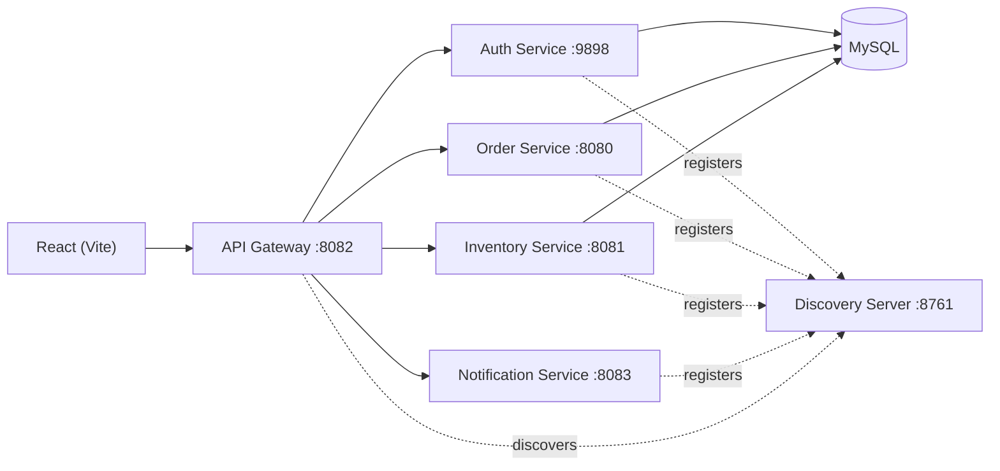

# Ecommerce Microservices

A small e-commerce backend split into services with Eureka discovery and an API Gateway.
Authentication uses JWT and Google OAuth2. The React app is a minimal auth/admin UI for
login/register, Google sign-in, and role management.

## Services and Ports
| Service | Port | Purpose |
| --- | --- | --- |
| Discovery Server | 8761 | Service registry (Eureka) |
| API Gateway | 8082 | Single entry point + JWT/RBAC enforcement |
| Auth Service | 9898 | Login/register, JWT, Google OAuth2 |
| Order Service | 8080 | Places orders, reserves stock |
| Inventory Service | 8081 | Product stock + reservation |
| Notification Service | 8083 | Stub notifications (ack only) |

## Architecture


## Prerequisites
- Java 21
- Maven
- Node.js 18+
- Docker 
- MySQL 


## Run Locally (Docker Compose)
```bash
cd /Users/atindraa/Desktop/ecommerce-microservice

export GOOGLE_CLIENT_ID=your_google_client_id
export GOOGLE_CLIENT_SECRET=your_google_client_secret
export JWT_SECRET=change-this-secret
export DB_PASSWORD=localpass

docker compose up --build
```

Frontend (separate terminal):
```bash
cd /Users/atindraa/Desktop/ecommerce-microservice/frontend
npm install
npm run dev
```

## Run Locally (Manual)
1. Start MySQL and create databases:
   ```sql
   CREATE DATABASE IF NOT EXISTS auth_db;
   CREATE DATABASE IF NOT EXISTS inventory_db;
   CREATE DATABASE IF NOT EXISTS order_db;
   ```
2. Start Discovery Server:
   ```bash
   mvn -q spring-boot:run -f /Users/atindraa/Desktop/ecommerce-microservice/DiscoveryService/pom.xml
   ```
3. Start Auth, Inventory, Order, Notification:
   ```bash
   mvn -q spring-boot:run -f /Users/atindraa/Desktop/ecommerce-microservice/AuthService/pom.xml
   mvn -q spring-boot:run -f /Users/atindraa/Desktop/ecommerce-microservice/InventoryService/pom.xml
   mvn -q spring-boot:run -f /Users/atindraa/Desktop/ecommerce-microservice/OrderService/pom.xml
   mvn -q spring-boot:run -f /Users/atindraa/Desktop/ecommerce-microservice/notification-service/pom.xml
   ```
4. Start API Gateway:
   ```bash
   mvn -q spring-boot:run -f /Users/atindraa/Desktop/ecommerce-microservice/api-gateway/pom.xml
   ```
5. Start the frontend:
   ```bash
   cd /Users/atindraa/Desktop/ecommerce-microservice/frontend
   npm install
   npm run dev
   ```

## Auth Flow
Base URL (via Gateway): `http://localhost:8082`

- Register: `POST /api/auth/register`
- Login: `POST /api/auth/login`
- Me: `GET /api/auth/me`
- Introspect: `POST /api/auth/introspect`
- Google OAuth2: `/oauth2/authorization/google`

Google redirect URI to register:
```
http://localhost:8082/login/oauth2/code/google
```

Use the JWT from login/register on secured endpoints:
```
Authorization: Bearer <token>
```

## RBAC (Enforced at Gateway + Services)
- `ROLE_USER`: place orders, read inventory, ping notifications
- `ROLE_ADMIN`: create inventory items, broadcast notifications, manage users

Initial admins are seeded from `ADMIN_EMAILS`.

## Admin Role Management
- List users: `GET /api/auth/admin/users`
- Update roles: `PUT /api/auth/admin/users/{id}/roles`
- Audit log: `GET /api/auth/admin/audit`

The frontend exposes a simple admin UI for these endpoints.

## Inventory + Orders
- Check stock: `GET /api/inventory/{sku-code}`
- Create item (admin): `POST /api/inventory`
- Reserve stock (internal): `POST /api/inventory/reserve`
- Place order: `POST /api/order`

### Concurrency Behavior
Inventory reservation uses an atomic update to prevent overselling. If stock is
insufficient, the reservation fails and the order is not saved.

## Notification Service
- `GET /api/notification/ping`
- `POST /api/notification/broadcast`

The broadcast endpoint currently returns an acknowledgement only; no external
provider is wired yet.

## Tests
Tests run against MySQL (no H2). From each service directory:
```bash
mvn -q test
```

## EC2 Deployment
Scripts live in `/Users/atindraa/Desktop/ecommerce-microservice/deploy/aws`.
1. Create a security group:
```bash
export AWS_REGION=us-east-1
export VPC_ID=vpc-xxxx
export MY_IP=203.0.113.10/32
export PUBLIC_PORTS=8082

./deploy/aws/create-security-group.sh
```
2. Bootstrap Docker on the EC2 instance:
```bash
./deploy/aws/bootstrap-ec2.sh
```
3. Deploy services on the EC2 host:
```bash
cp deploy/aws/.env.example .env
./deploy/aws/deploy-compose.sh
```
